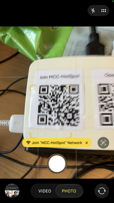
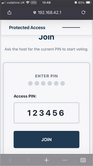
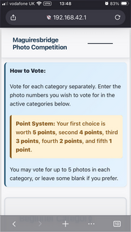
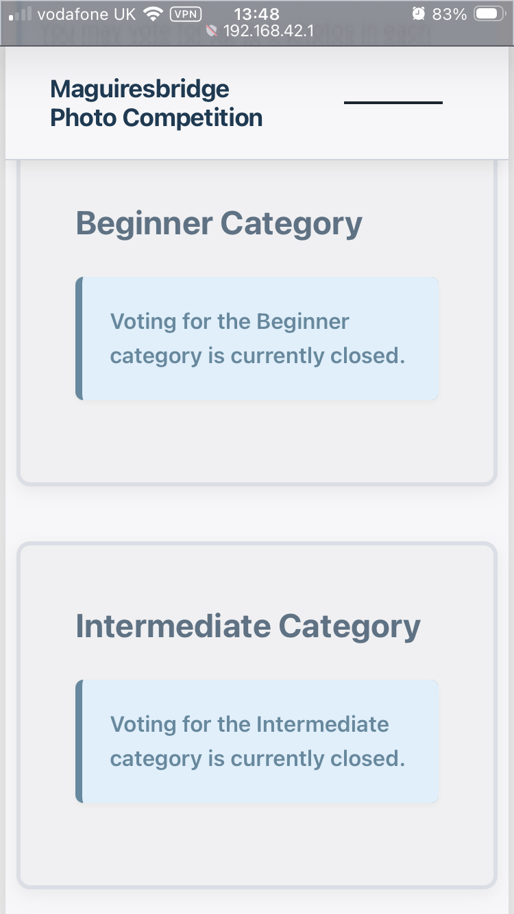
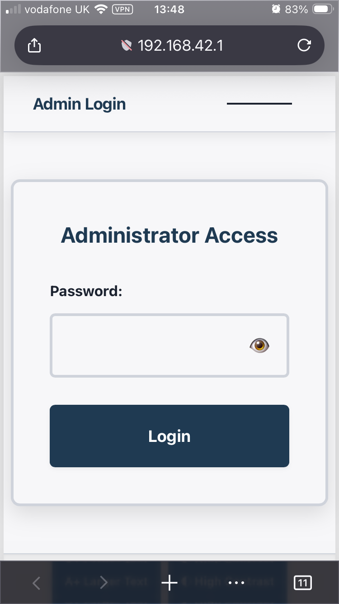
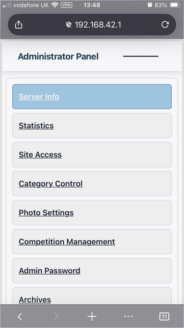
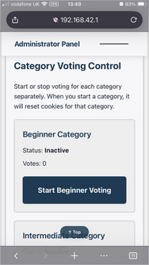
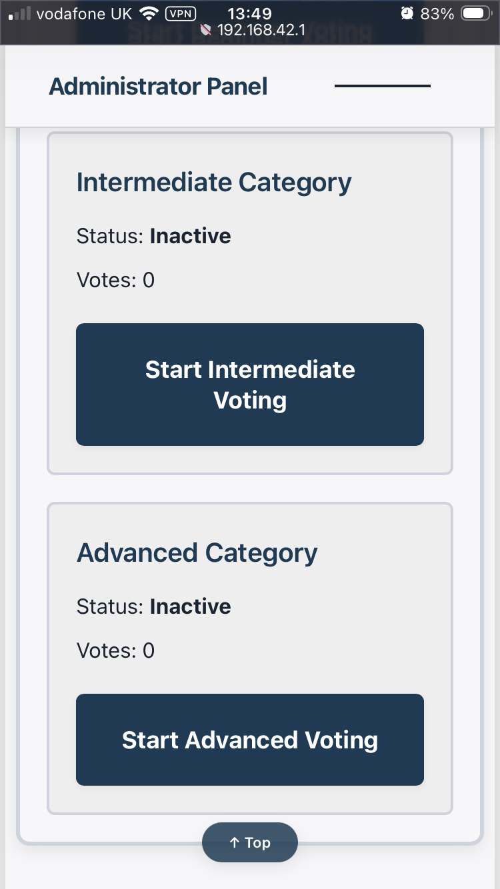
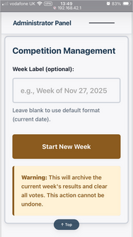
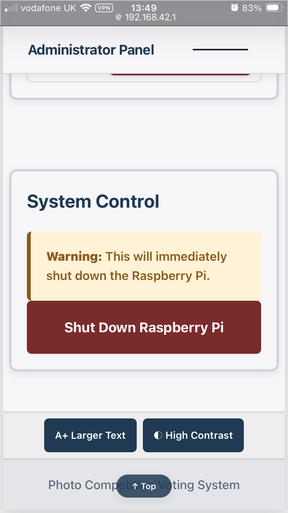

# MCC voting raspberry

text text text

## Join the hotspot

Use your phone camera to scan the QR code to join the hotspot:



## Opening the web page

You can type the address of the page:
```
   http://192.168.42.1/
```
or just type:
```
   192.168.42.1
```

You can also open the page by using your camera to scan the second QR code:


This will bring the page to sign in. Type the PIN in the box and tap "```join```":



This will bring up the start page - with the voting instructions visible at the top:



Scroll down to the voting section. The Beginner, Intermediate and Advanced categories will be available before each competition begins.



Complete the boxes as you wish and click the Submit button.

## Admin

### Starting voting

To access the Admin pages for various functions - including allowing the competitions to begin - click the menu at the top-right and select "Admin", type in the password and select "```Login```":



Scroll down to "Category Control" and select the button for Beginner, Intermediate or Advanced voting.



Once the button has been selected, members will be able to vote (on the previous page).





### Archiving

Once the evening is complete, on the Admin page, scroll down to "Competition Management" and click the "Start New Week" button. You can add in an optional label if you wish.



**Note: clicking the "Start New Week" will clear all the current votes ready for the next week of the Club.**

## Shutting Down

At the end of the evening, you can shurdown the Raspberry by scrolling to the bottom of the Admin page and clicking the "Shutdown" button:



You'll be asked to confirm and the shutdown will take around 25 seconds.

## QR Codes

### Join Network

(password: /mcchotspot/)


### Open Page


