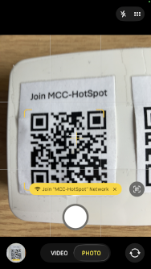
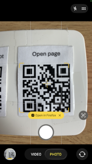

# MCC voting raspberry

This website will allow Camera Club members to vote for photographs in Club competitions.

## Join the hotspot

Use your phone camera to scan the QR code to join the hotspot:



## Opening the web page

You can type the address of the page:
```
   http://192.168.42.1/
```
or just type:
```
   192.168.42.1
```

You can also open the page by using your camera to scan the second QR code:



This will bring the page to sign in. Type the PIN in the box and tap "```join```":


This will bring up the start page - with the voting instructions visible at the top:


Scroll down to the voting section. The Beginner, Intermediate and Advanced categories will be available before each competition begins.


Complete the boxes as you wish and click the Submit button.

## QR Codes

### Join Network

(password: _mcchotspot_)


### Open Page


